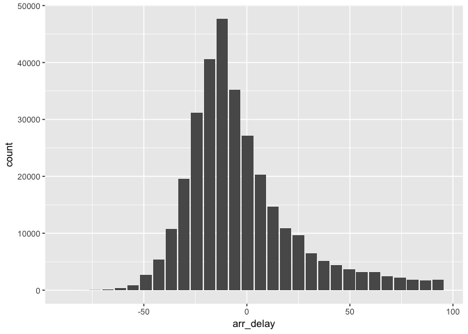
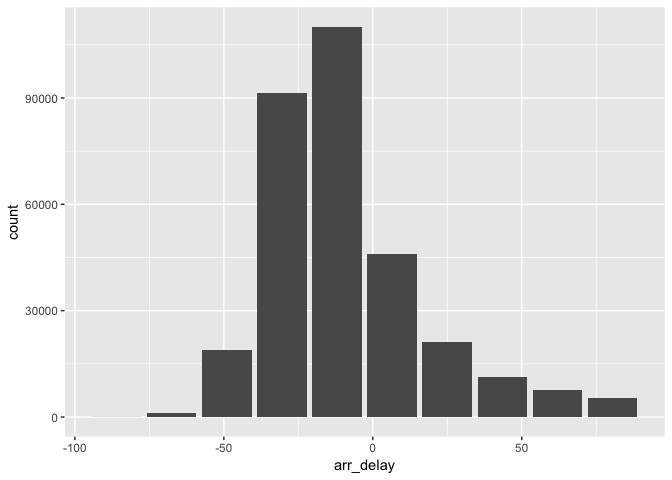
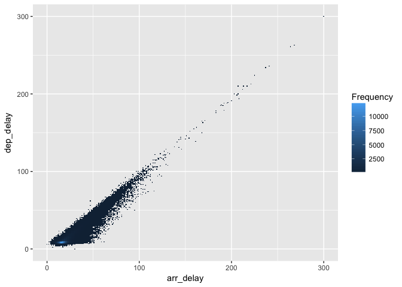
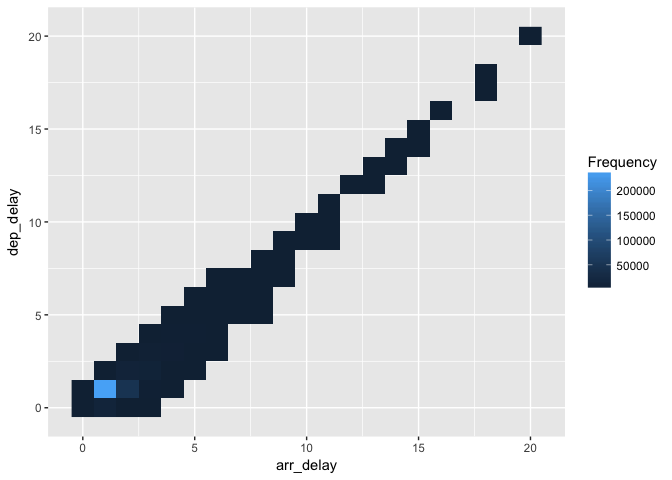

dbutilties
================

A set of time and cost (import/compute) saving functions as tools:

-   **db\_histogram** - Calculates the bins of a Histogram inside the database. And by default returns a data frame with the values. When the **output** argument is changed to **ggplot** the function will return a geom\_bar ggplot, which meant for a quick plot view.

-   **db\_raster** - Groups and aggregates the values of two variables so as to allow a large dataset to be visualized. When the **output** argument is changed to **ggplot** the function will return a geom\_bar ggplot, which meant for a quick plot view.

-   **db\_map\_csv** - Reads the first five rows of a CSV file and builds a *Create Table* statement text that can be run in Hive. It can also create the list needed to pass in **sparklyr** to avoid mapping each column manually

Installation
------------

You can install **dbutilities** from GitHub

``` r
devtools::install_github("edgararuiz/dbutilities")
```

Using dbutilities
-----------------

We will review how to use **dbutilities** with the following example. We'll start by loading the needed libraries. We will use the *nycflights13* as the data source for this example

``` r
# Required
library(tidyverse)
library(sparklyr)
library(dbutilities)
# Only for the example
library(nycflights13)
```

Calling the **flights** table into R memory

``` r
data("flights")
flights
```

    ## # A tibble: 336,776 × 19
    ##     year month   day dep_time sched_dep_time dep_delay arr_time
    ##    <int> <int> <int>    <int>          <int>     <dbl>    <int>
    ## 1   2013     1     1      517            515         2      830
    ## 2   2013     1     1      533            529         4      850
    ## 3   2013     1     1      542            540         2      923
    ## 4   2013     1     1      544            545        -1     1004
    ## 5   2013     1     1      554            600        -6      812
    ## 6   2013     1     1      554            558        -4      740
    ## 7   2013     1     1      555            600        -5      913
    ## 8   2013     1     1      557            600        -3      709
    ## 9   2013     1     1      557            600        -3      838
    ## 10  2013     1     1      558            600        -2      753
    ## # ... with 336,766 more rows, and 12 more variables: sched_arr_time <int>,
    ## #   arr_delay <dbl>, carrier <chr>, flight <int>, tailnum <chr>,
    ## #   origin <chr>, dest <chr>, air_time <dbl>, distance <dbl>, hour <dbl>,
    ## #   minute <dbl>, time_hour <dttm>

### Connecting to Spark

We will use a local Spark context

``` r
conf <- spark_config()
  conf$`sparklyr.shell.driver-memory` <- "16G"
  sc <- spark_connect(master = "local", 
                      version = "2.1.0",
                      config = conf)
```

db\_map\_csv
------------

### CSV file

We will create a CSV file based on the **flights** table to use as our source. The file is then placed on a folder that should contain only CSV files with the exact same layout.

``` r
if(!dir.exists("csv"))dir.create("csv")
write_csv(flights, "csv/flights.csv")
list.files("csv/")
```

    ## [1] "flights.csv"

### Hive table

The following **db\_map\_csv** call will return a character variable containing the SQL statement that can be used to create the table.

``` r
create_sql <- db_map_csv(sample_file = "csv/flights.csv", 
                         db = "hive", 
                         dir_location = file.path(getwd(), "csv"),
                         table_name = "sql_flights")
create_sql
```

    ## [1] "CREATE EXTERNAL TABLE sql_flights (year int,month int,day int,dep_time int,sched_dep_time int,dep_delay double,arr_time int,sched_arr_time int,arr_delay double,carrier string,flight int,tailnum string,origin string,dest string,air_time double,distance double,hour double,minute double,time_hour timestamp) ROW FORMAT DELIMITED FIELDS TERMINATED BY ',' LINES TERMINATED BY '\n' LOCATION '/Users/edgar/dbutilities/csv'"

Using the **DBI** package, we will pass the SQL statement in the resulting *create\_sql*

``` r
DBI::dbGetQuery(sc, create_sql)
```

    ## Warning in max(n): no non-missing arguments to max; returning -Inf

``` r
tbl(sc, "sql_flights")
```

    ## Source:   query [3.368e+05 x 19]
    ## Database: spark connection master=local[8] app=sparklyr local=TRUE
    ## 
    ##     year month   day dep_time sched_dep_time dep_delay arr_time
    ##    <int> <int> <int>    <int>          <int>     <dbl>    <int>
    ## 1     NA    NA    NA       NA             NA       NaN       NA
    ## 2   2013     1     1      517            515         2      830
    ## 3   2013     1     1      533            529         4      850
    ## 4   2013     1     1      542            540         2      923
    ## 5   2013     1     1      544            545        -1     1004
    ## 6   2013     1     1      554            600        -6      812
    ## 7   2013     1     1      554            558        -4      740
    ## 8   2013     1     1      555            600        -5      913
    ## 9   2013     1     1      557            600        -3      709
    ## 10  2013     1     1      557            600        -3      838
    ## # ... with 3.368e+05 more rows, and 12 more variables:
    ## #   sched_arr_time <int>, arr_delay <dbl>, carrier <chr>, flight <int>,
    ## #   tailnum <chr>, origin <chr>, dest <chr>, air_time <dbl>,
    ## #   distance <dbl>, hour <dbl>, minute <dbl>, time_hour <chr>

### sparklyr

The following **db\_map\_csv** command will return a list that contains all of the field names. Because currently, the spark\_read\_csv command does not like NA's in numeric fields, all fields are mapped as character. They can then be converted to the proper type using dplyr.

``` r
flights_columns <- db_map_csv(sample_file = "csv/flights.csv")
flights_columns
```

    ## $year
    ## [1] "character"
    ## 
    ## $month
    ## [1] "character"
    ## 
    ## $day
    ## [1] "character"
    ## 
    ## $dep_time
    ## [1] "character"
    ## 
    ## $sched_dep_time
    ## [1] "character"
    ## 
    ## $dep_delay
    ## [1] "character"
    ## 
    ## $arr_time
    ## [1] "character"
    ## 
    ## $sched_arr_time
    ## [1] "character"
    ## 
    ## $arr_delay
    ## [1] "character"
    ## 
    ## $carrier
    ## [1] "character"
    ## 
    ## $flight
    ## [1] "character"
    ## 
    ## $tailnum
    ## [1] "character"
    ## 
    ## $origin
    ## [1] "character"
    ## 
    ## $dest
    ## [1] "character"
    ## 
    ## $air_time
    ## [1] "character"
    ## 
    ## $distance
    ## [1] "character"
    ## 
    ## $hour
    ## [1] "character"
    ## 
    ## $minute
    ## [1] "character"
    ## 
    ## $time_hour
    ## [1] "character"

The resulting list can then be passed in the *columns* argument. Also, make sure to pass FALSE in the *infer\_schema* argument. This technique looked to be the fastest way of importing a CSV file into Spark, see: <http://spark.rstudio.com/example-s3.html>

``` r
flights_noinfer <- spark_read_csv(sc, 
                                  name = "noinfer_flights", 
                                  path = "csv/",
                                  infer_schema = FALSE,
                                  columns = flights_columns)

tbl(sc, "noinfer_flights")
```

    ## Source:   query [3.368e+05 x 19]
    ## Database: spark connection master=local[8] app=sparklyr local=TRUE
    ## 
    ##     year month   day dep_time sched_dep_time dep_delay arr_time
    ##    <chr> <chr> <chr>    <chr>          <chr>     <chr>    <chr>
    ## 1   2013     1     1      517            515       2.0      830
    ## 2   2013     1     1      533            529       4.0      850
    ## 3   2013     1     1      542            540       2.0      923
    ## 4   2013     1     1      544            545      -1.0     1004
    ## 5   2013     1     1      554            600      -6.0      812
    ## 6   2013     1     1      554            558      -4.0      740
    ## 7   2013     1     1      555            600      -5.0      913
    ## 8   2013     1     1      557            600      -3.0      709
    ## 9   2013     1     1      557            600      -3.0      838
    ## 10  2013     1     1      558            600      -2.0      753
    ## # ... with 3.368e+05 more rows, and 12 more variables:
    ## #   sched_arr_time <chr>, arr_delay <chr>, carrier <chr>, flight <chr>,
    ## #   tailnum <chr>, origin <chr>, dest <chr>, air_time <chr>,
    ## #   distance <chr>, hour <chr>, minute <chr>, time_hour <chr>

Plotting functions
------------------

Copying the *flights* data frame into Spark

``` r
flights <- copy_to(sc, flights, "spark_flights")
```

### db\_histogram

We will select the *distance* field and then pass the *db\_histogram* function using all of the defaults. This will return a ggplot with a 30 bin histogram.

``` r
flights %>%
  filter(arr_delay < 100) %>%
  select(arr_delay) %>%
  db_histogram()
```



We can also control the number of bins returned.

``` r
flights %>%
  filter(arr_delay < 100) %>%
  select(arr_delay) %>%
  db_histogram(bins = 10)
```



Passing the "data" in the **output** argument will return a data frame with the results. This is intended for the user to plot with a different package.

``` r
flights %>%
  filter(arr_delay < 100) %>%
  select(arr_delay) %>%
  db_histogram(output = "data")
```

    ## # A tibble: 30 × 2
    ##    count bin_values
    ##    <dbl>      <dbl>
    ## 1      1  -86.00000
    ## 2      4  -79.83333
    ## 3     31  -73.66667
    ## 4    128  -67.50000
    ## 5    311  -61.33333
    ## 6    825  -55.16667
    ## 7   2689  -49.00000
    ## 8   5324  -42.83333
    ## 9  10771  -36.66667
    ## 10 19604  -30.50000
    ## # ... with 20 more rows

### db\_raster

We will select the *arr\_delay* and *dep\_delay* fields to create a raster plot. The defaults return a ggplot with a resolutions of 300.

``` r
flights %>%
  select(arr_delay, dep_delay) %>%
  db_raster()
```



Reducing the resolution returns larger squares and, most importantly, less records into R memory.

``` r
flights %>%
  select(arr_delay, dep_delay) %>%
  db_raster(resolution = 20)
```



Just like db\_histogram, passing "data" to the *output* argument returns a data frame.

``` r
flights %>%
  select(arr_delay, dep_delay) %>%
  db_raster(output = "data")
```

    ## Source: local data frame [2,679 x 3]
    ## Groups: res_x [168]
    ## 
    ##    res_x res_y     n
    ##    <dbl> <dbl> <dbl>
    ## 1     21    10  2800
    ## 2     23    10  1430
    ## 3     15     9 11091
    ## 4     22     9  2319
    ## 5     21     9  4394
    ## 6     19     9  8471
    ## 7     17    10  5571
    ## 8     22    10  1599
    ## 9     14     9  6789
    ## 10    25    10   714
    ## # ... with 2,669 more rows

Closing the connection
----------------------

``` r
spark_disconnect(sc)
```
