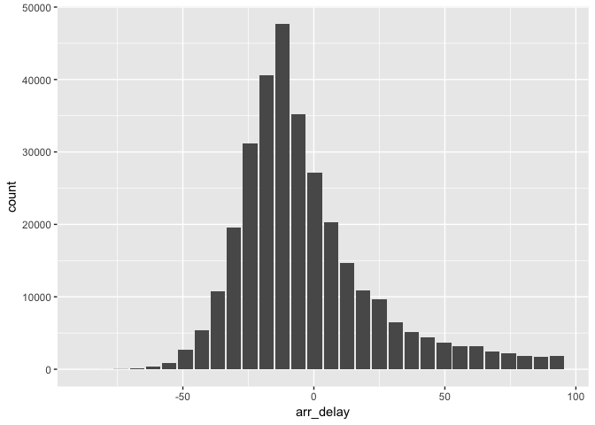
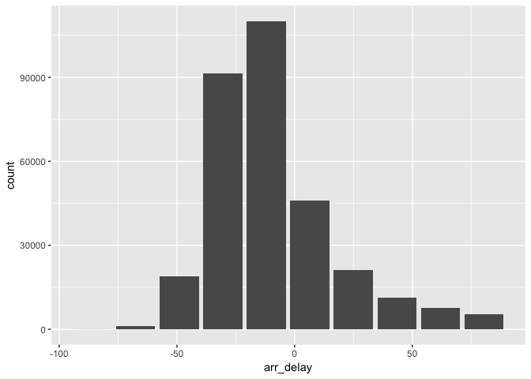
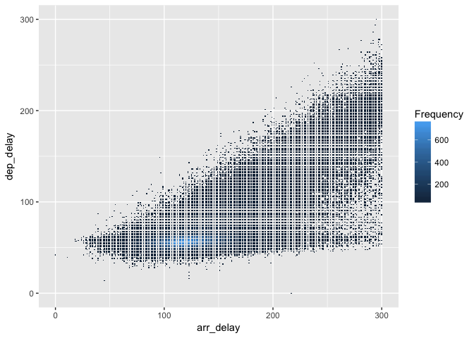
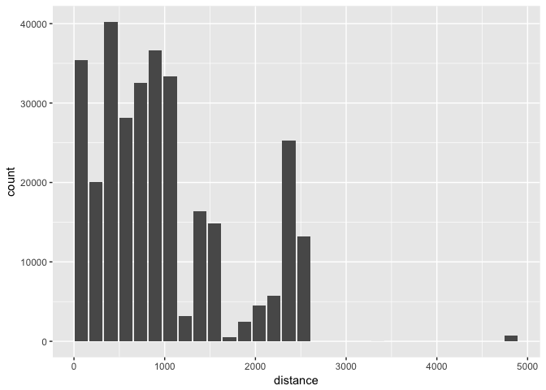

dbutilties
================

A set of time and cost (import/compute) saving functions as tools:

-   **db\_histogram** - Calculates the bins of a Histogram inside the database. And by default returns a data frame with the values. When the **output** argument is changed to **ggplot** the function will return a geom\_bar ggplot, which meant for a quick plot view.

-   **db\_raster** - Groups and aggregates the values of two variables so as to allow a large dataset to be visualized. When the **output** argument is changed to **ggplot** the function will return a geom\_bar ggplot, which meant for a quick plot view.

-   **db\_map\_csv** - Reads the first five rows of a CSV file and builds a *Create Table* statement text that can be run in Hive. It can also create the list needed to pass in **sparklyr** to avoid mapping each column manually

``` r
devtools::install_github("edgararuiz/dbutilities")
```

``` r
library(dplyr)
library(sparklyr)
library(dbutilities)
library(ggplot2)
library(nycflights13)
```

``` r
conf <- spark_config()
  conf$`sparklyr.shell.driver-memory` <- "16G"
  sc <- spark_connect(master = "local", 
                      version = "2.1.0",
                      config = conf)
```

``` r
data("flights")
flights <- copy_to(sc, flights, "spark_flights")
```

``` r
flights %>%
  filter(arr_delay < 100) %>%
  select(distance) %>%
  db_histogram()
```

    ## # A tibble: 30 × 2
    ##    count bin_values
    ##    <dbl>      <dbl>
    ## 1  35440    80.0000
    ## 2  20079   243.4333
    ## 3  40216   406.8667
    ## 4  28191   570.3000
    ## 5  32569   733.7333
    ## 6  36607   897.1667
    ## 7  33329  1060.6000
    ## 8   3161  1224.0333
    ## 9  16389  1387.4667
    ## 10 14810  1550.9000
    ## # ... with 20 more rows

``` r
flights %>%
  filter(arr_delay < 100) %>%
  select(arr_delay) %>%
  db_histogram(output = "ggplot")
```



``` r
flights %>%
  filter(arr_delay < 100) %>%
  select(arr_delay) %>%
  db_histogram(bins = 10,  output = "ggplot")
```



``` r
flights %>%
  filter(arr_delay < 100) %>%
  select(arr_delay, dep_delay) %>%
  db_raster()
```

    ## Source: local data frame [11,836 x 3]
    ## Groups: res_x [176]
    ## 
    ##    res_x res_y     n
    ##    <dbl> <dbl> <dbl>
    ## 1    172    68    41
    ## 2    117    58   687
    ## 3    133    62   418
    ## 4    162    78    49
    ## 5    144    51   130
    ## 6    125    61   537
    ## 7    144    57   359
    ## 8    146    58   337
    ## 9    123    62   414
    ## 10   136    55   447
    ## # ... with 11,826 more rows

``` r
flights %>%
  filter(arr_delay < 100) %>%
  select(arr_delay, dep_delay) %>%
  db_raster(output = "ggplot")
```



``` r
flights %>%
  filter(arr_delay < 100) %>%
  select(arr_delay, dep_delay) %>%
  db_raster(resolution = 20, output = "ggplot")
```



``` r
spark_disconnect(sc)
```
